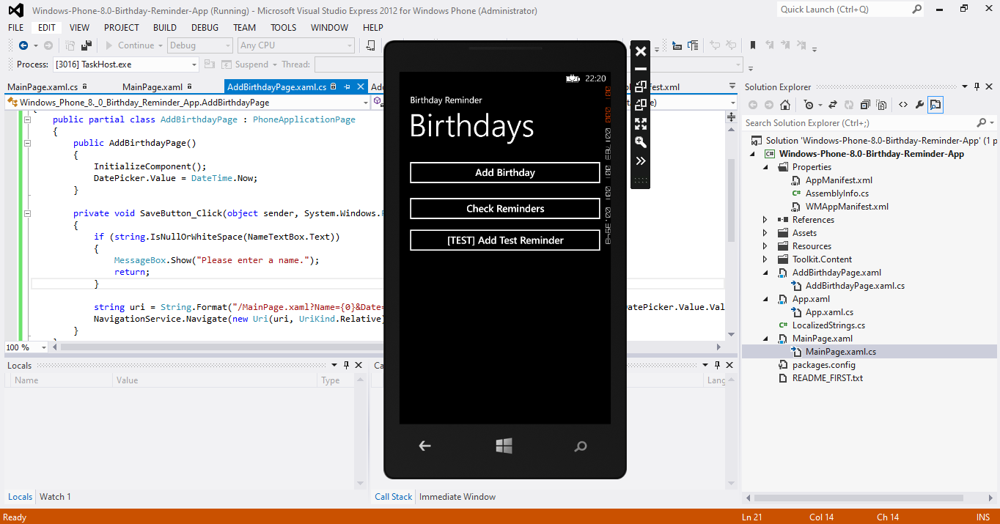
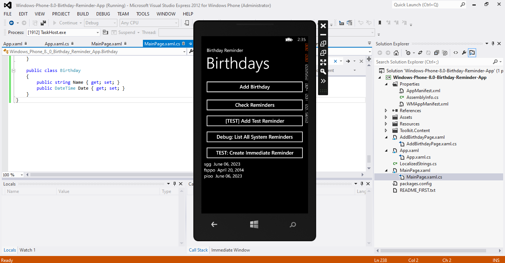

# Windows Phone 8.0 Birthday Reminder App

A simple yet elegant application for Windows Phone 8.0, designed to help users manage and receive reminders for birthdays. Built with XAML, it features a user-friendly interface and leverages Windows Phone live tiles for notifications.

[](https://opensource.org/licenses/MIT)

## Table of Contents
- [Features](#features)
- [Screenshots](#screenshots)
- [Requirements](#requirements)
- [Setup Instructions](#setup-instructions)
- [Usage](#usage)
- [Project Structure](#project-structure)
- [Contributing](#contributing)
- [License](#license)

## Features
- **Add Birthdays**: Store names and dates for birthday tracking.
- **Reminders**: Get notifications for upcoming birthdays.
- **Live Tiles**: View reminders on FlipCycle or Iconic tiles from the home screen.
- **Simple Interface**: Navigate and manage birthdays with ease.

## Screenshots
| Main Screen | Test & Debug |
|-------------|--------------|
|  |  |

## Requirements
- Windows Phone 8.0 device or emulator
- Visual Studio 2012 or later with Windows Phone 8.0 SDK

## Setup Instructions
1. Clone the repository:
   ```bash
   git clone https://github.com/johnkoshy/Windows-Phone-8.0-Birthday-Reminder-App.git
2. Open the solution file (Windows-Phone-8.0-Birthday-Reminder-App.sln) in Visual Studio.
3. Ensure the Windows Phone 8.0 SDK is installed.
4. Build and deploy the app to a Windows Phone 8.0 device or emulator.

## Usage

1. Launch the app on your Windows Phone 8.0 device.
2. Go to the "Add Birthday" page to enter a name and date.
3. Save the entry to enable reminders.
4. Pin the app to your home screen for live tile updates.

## Project Structure
- MainPage.xaml: Main interface for viewing birthdays.
- AddBirthdayPage.xaml: Page for adding new birthday entries.
- Assets/: Contains app icons and tile images.
- Screenshots/: Stores app screenshots.
- Toolkit.Content/: Holds application bar icons for user interactions.

## Contributing
Contributions are welcome! 🎉 Please submit a pull request or open an issue on GitHub for suggestions or bug reports.

## License
This project is licensed under the MIT License.
